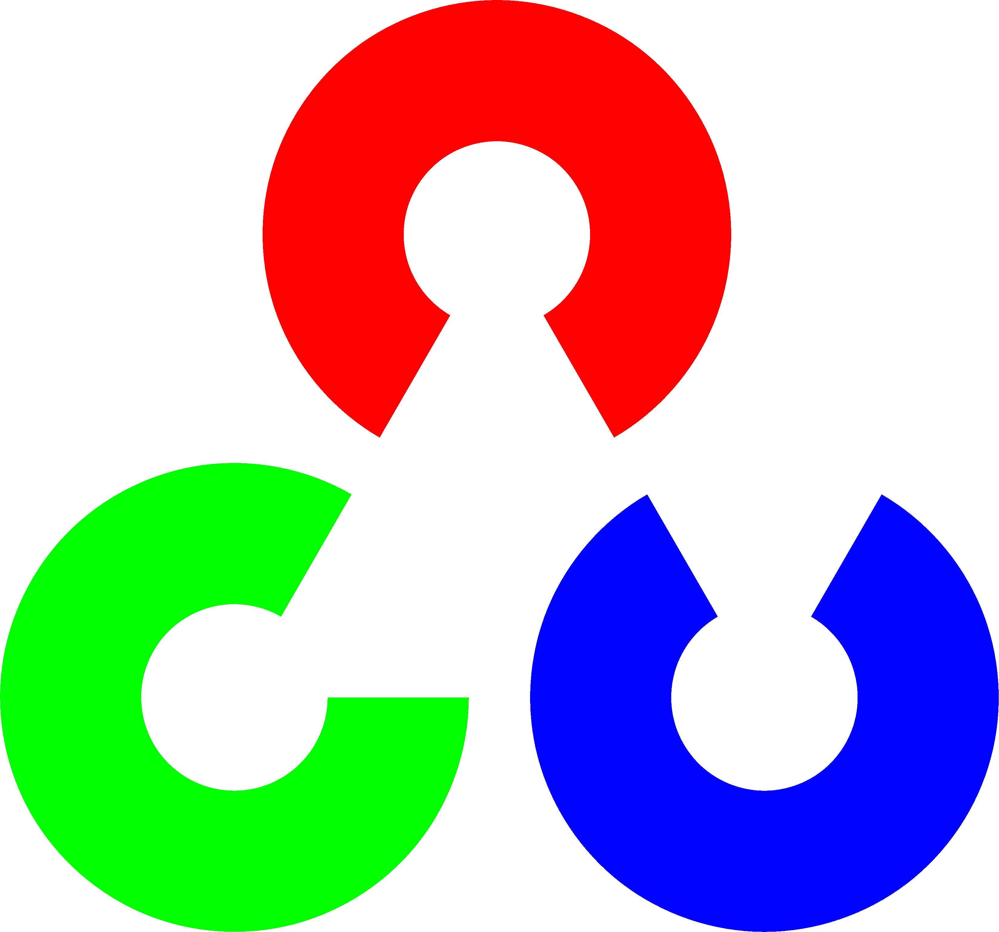

# Avneesh Mishra (TheProjectsGuy) Welcomes you!

Hi there 👋. This is the profile of Avneesh Mishra.

 

## Currently

I'm pursuing M.S. by Research (CSE) at IIIT Hyderabad, in Robotics Research Center under Prof. Madhava Krishna.

My work is on SLAM (Simultaneous Localization and Mapping) algorithms.

## Contents

- [Avneesh Mishra (TheProjectsGuy) Welcomes you!](#avneesh-mishra-theprojectsguy-welcomes-you)
    - [Currently](#currently)
    - [Contents](#contents)
    - [Activities](#activities)
        - [RRC, IIIT Hyderabad](#rrc-iiit-hyderabad)
    - [Courses](#courses)
        - [IIIT Hyderabad](#iiit-hyderabad)
    - [Skills](#skills)

## Activities

Things I've done

### RRC, IIIT Hyderabad

- Multi-View Geometry (4/4) - Summer School 2022. [GitHub](https://github.com/TheProjectsGuy/RRC22-Summer-School-MVG4), [Notion](https://laksh-nanwani.notion.site/laksh-nanwani/Robotics-Research-Center-Summer-School-2022-8ee9a9ff7fc445619c2b650a1557e946).

## Courses

<!-- From: https://gist.github.com/pierrejoubert73/902cc94d79424356a8d20be2b382e1ab -->

    
 IIIT Hyderabad - Academic courses 

### IIIT Hyderabad

**Spring 2022**

- [CS7.505 - Computer Vision](https://github.com/TheProjectsGuy/CV22-CS7.505)
- [EC9.404 - Independent Study](https://github.com/TheProjectsGuy/IS_RPN22-EC9.404)
- [EC4.402 - Introduction to UAV Design](https://github.com/TheProjectsGuy/UAV22-EC4.402)

**Monsoon 2021**

- [CS7.403 - Statistical Methods in AI](https://github.com/TheProjectsGuy/SMAI21-CS7.403)
- [CS7.503 - Mobile Robotics](https://github.com/TheProjectsGuy/MR21-CS7.503)
- [EC4.401 - Robotics: Dynamics and Control](https://github.com/TheProjectsGuy/RDC21-EC4.401)

## Skills

- 👨‍💻 Programming languages

    
    

- 💻 I am experienced in the following frameworks

    
    
    
    

Miscellaneous links

- [RRC SysAdmin Notion Page](https://www.notion.so/RRC-System-Administrator-s-Guide-c8954b4a4bc04b2f8e17fd0e9f8086cd) (my personal reference)

<!-- My stats (from [anuraghazra/github-readme-stats](https://github.com/anuraghazra/github-readme-stats))

 -->

<!--
From: https://github.com/anuraghazra/github-readme-stats

-->

<!--
**TheProjectsGuy/TheProjectsGuy** is a ✨ _special_ ✨ repository because its `README.md` (this file) appears on your GitHub profile.

Here are some ideas to get you started:

- 🔭 I’m currently working on ...
- 🌱 I’m currently learning ...
- 👯 I’m looking to collaborate on ...
- 🤔 I’m looking for help with ...
- 💬 Ask me about ...
- 📫 How to reach me: ...
- 😄 Pronouns: ...
- ⚡ Fun fact: ...
-->
